# Mining Massive Data Sets - Final project

> by John Cunniff


## Initial Overview

I've downloaded some of the crawl data from september of this year from [common crawl](https://index.commoncrawl.org/). With this data, I want to do some form of Clustering / Social Network Graph type of processing.

### Preprocessing

The data came in a weird custom format that just wouldn't be easy to work with. I wrote [stream.py](./stream.py) which does some relatively simplistic streaming of the weird format to csv in a thread pool. Along with that I added the resolved IP, the [ASN](https://en.wikipedia.org/wiki/Autonomous_system_%28Internet%29), and the country the IP belongs to.

This step took a really long time. I pushed my poweredge R710 to the limit for 130+ hours. Resolving the DNS entires was the main thing slowing the streaming down.

### The raw data

I estimate that I have ~1.96B rows of individual documents. This is a sample of the raw data after post processing

|INDEX |domain              |ip           |asn_num|country|asn_org                |path                                                        |
|------|--------------------|-------------|-------|-------|-----------------------|------------------------------------------------------------|
|0     |aice-interpretes.com|89.140.72.171|6739   |ES     |ONO-AS Cableuropa - ONO|/es/consejos-sonidos-eventos-traductores.php                |
|1     |aice-interpretes.com|89.140.72.171|6739   |ES     |ONO-AS Cableuropa - ONO|/es/contacto-interpretes-traductores-de-conferencia-aice.php|
|2     |aice-interpretes.com|89.140.72.171|6739   |ES     |ONO-AS Cableuropa - ONO|/es/contratar-interprete-de-conferencia-aice.php            |
|3     |aice-interpretes.com|89.140.72.171|6739   |ES     |ONO-AS Cableuropa - ONO|/es/enlace-1-traductor-interprete.php                       |
|4     |aice-interpretes.com|89.140.72.171|6739   |ES     |ONO-AS Cableuropa - ONO|/es/enlace-6-traductor-interprete.php                       |
|5     |aice-interpretes.com|89.140.72.171|6739   |ES     |ONO-AS Cableuropa - ONO|/es/equipo-tecnico-eventos-traductores.php                  |
|6     |aice-interpretes.com|89.140.72.171|6739   |ES     |ONO-AS Cableuropa - ONO|/es/estudiar-grado-traductor-interprete.php                 |
|7     |aice-interpretes.com|89.140.72.171|6739   |ES     |ONO-AS Cableuropa - ONO|/es/estudiar-interpretacion.php                             |
|8     |aice-interpretes.com|89.140.72.171|6739   |ES     |ONO-AS Cableuropa - ONO|/es/estudiar-postgrado-traductor-interprete.php             |
|9     |aice-interpretes.com|89.140.72.171|6739   |ES     |ONO-AS Cableuropa - ONO|/es/experiencia-especializacion.php                         |


### Graphs




I've begun to create graphs from the raw data using [dgraph](https://dgraph.io/). I would not recommend that anyone uses dgraph. It uses its own version of graphql. This decision makes dgraph another promising tool to fall for the overhyped garbage that is graphql. All the graphql schema, and query crap stretched out what should have taken 20 minutes into 2 days.

anyway....

I've created a graph where the different unique entities within the csv are represented. Nodes are ASNs, countries, domains, and documents. Using a fraction of a percent of the data I have processed.


The red node in the center is the US. The blue nodes are the ASNs within the US (of the data that was rendered). The green nodes are the domains within the ASNs. The purple nodes off the domains are the documents seen (limited to 20 per domain).


The graph schema is as follows

```graphql
# ASN fields
asnnum: int @index(int) .
org: string .
domains: [uid] @reverse .

# Domain fields
domain: string @index(term,exact) .
tld: string .
ip: string .
documents: [uid] @reverse .
country: [uid] @reverse .

# Document fields
path: string @index(term) .

# Country fields
country_code: string @index(exact) .

type ASN {
    asnnum
    org
    domains
}

type Domain {
    domain
    tld
    ip
    documents
    country
}

type Document {
    path
}

type Country {
    country_code
    domains
}
```

### Queries

```graphql
query {  
  getcountry(func: type(Country)) {
    country_code

    domains(first: 100) {
      domain
      ~domains {
        asnnum
      }
      documents(first: 10) {
        path
      }
    }
  }
}
```


```graphql
query {  
  getcountry(func: eq(country_code, "US")) {
    country_code

    domains(first: 100) {
      domain
      ~domains {
        asnnum
      }
      documents(first: 10) {
        path
      }
    }
  }
}
```


### Graph Ingestion

In order to take the raw compressed csv's we created in the preprocessing stage, and stream it into dgraph we need to do 
a few clever things. In order to draw an edge in dgraph, you need to know what the uid of both nodes are. These
uids are created when we create the nodes themselves. With the amount of data we are dealing with,
this simple problem of needing to track the uids becomes something that requires a multi-layered approach.

This diagram shows the approximate system I used to ingest the graph. In the interest of simplicity I have reduced
the number of some services here. In reality, I used 16 Ingest Workers, 6 dgraph alpha nodes and 3 graph zero nodes.



When we're ingesting in domain, country and asn nodes into the graph we want to create the node *once*, save the node
uid somewhere then retrieve it when we see it again. 
With the volume of data we need to create then save, this is quite a large task. 
We can get the uid from dgraph after we have created a node, but these queries are unbelievably slow. 
The solution to this was a multi-layered caching system. When searching for an uid, we will start
at the first layer, trying each until we find the uid. Each level is slower but can hold more data than the one before it, 
with the last being getting the uid from dgraph.


#### Layer 1 - LRU

The first layer of the cache is both fastest and simplest. This layer is an in memory least recently used cache. 
We initialize a cache instance for each node type with some maximum size that makes sense for the node type.

#### Layer 2 - Redis

Redis is an object store service you can connect to over the network. We are using it as a key value store.
Being that we need to reach out to it over the network, this adds some overhead. Dispite this networking bottleneck,
redis is battle tested and highly effective at getting responses back quickly.

#### Layer 3 - Bloom

At this last layer we have RedisBloom instance. A bloom filter is a super interesting and underrated data structure.
A bloom filter is a structure that is used to determine set membership. Bloom filters are initialized with a p and n value.
The n value is the number of set elements you want to store in the bloom filter. The p value is the probability of
false positive.

> The way it works internally is quite clever, but outside the scope of what we need to know here. 
You can read more about implementation specifics [here](https://en.wikipedia.org/wiki/Bloom_filter).

At this stage, we want to check to see if the key we are looking for has a uid in dgraph. We will be able to check for 
key membership in the bloom filter significantly faster than querying dgraph. By tracking key membership for the nodes
already in dgraph at this stage we significantly reduce the number of cache misses that will result in a slow query to
dgraph.

#### Layer 4 -- DGraph

As an absolute last resort, we will query dgraph for the uid directly. These operations are very, very slow.


a