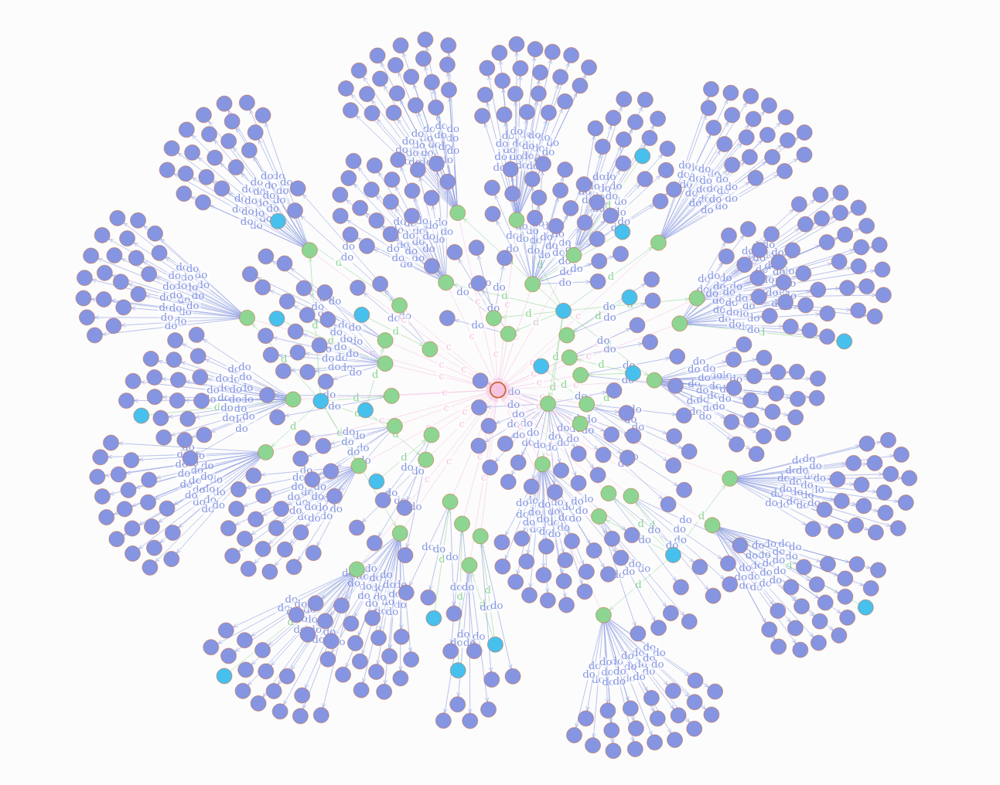
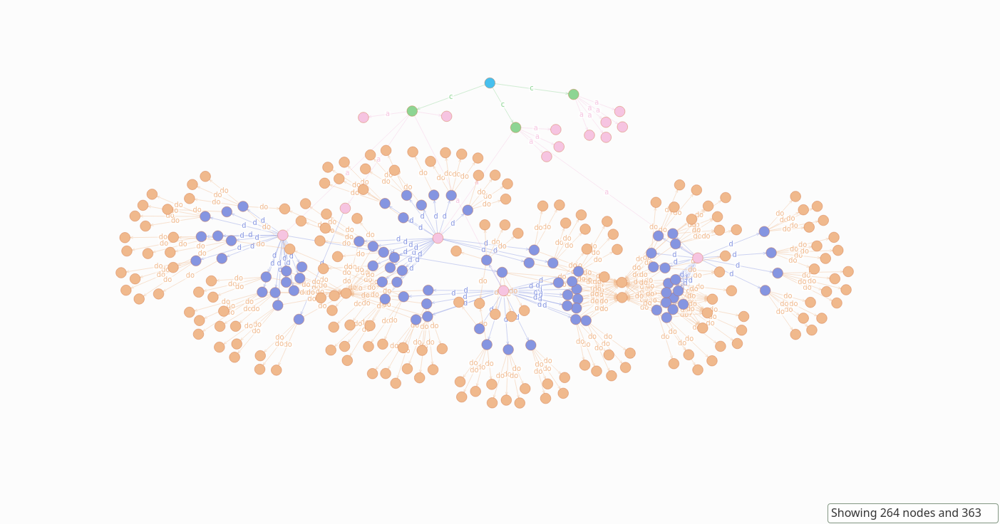
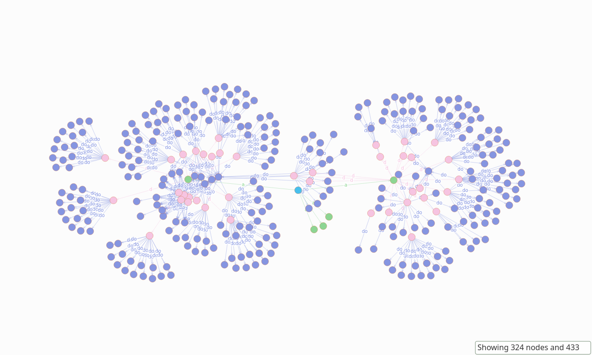
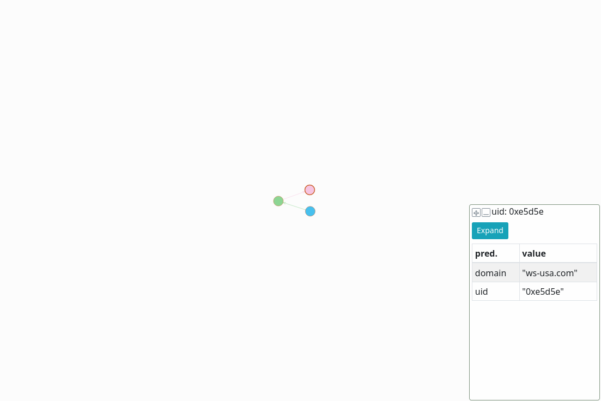
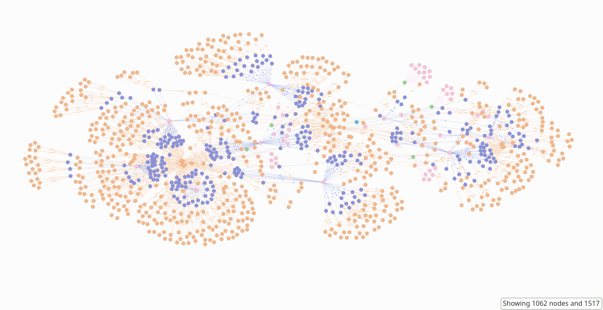

# Mining Massive Data Sets - Final project

> by John Cunniff


# Initial Overview

I've downloaded some of the crawl data from September of this year from [common crawl](https://index.commoncrawl.org/). With this data, I have created a high level graph of the portion of the Internet captured crawl data. To generate and visualize the graph, I have used a [DGraph](https://dgraph.io/) cluster.

## Preprocessing

The data came in a weird custom format that just wouldn't be easy to work with. I wrote [stream.py](./stream.py) which does some relatively simplistic streaming of the weird format to compressed csv in a processing pool. Along with that I added the resolved IP, I used publicly available [ASN](https://en.wikipedia.org/wiki/Autonomous_system_%28Internet%29) data, to determine the country a given IP address belongs to.

This step took a really long time. I pushed my poweredge R710 to the limit for 130+ hours. Resolving the DNS entires was the main thing slowing the streaming down.

The end result was 131 compressed csv files. Each of these files is around 300MB compressed, and upwards of 5-7 GB uncompressed.

```
common-crawl/
├── [281M]  cdx-00026.csv.gz
├── [274M]  cdx-00028.csv.gz
├── [336M]  cdx-00029.csv.gz
...
├── [413M]  cdx-00158.csv.gz
├── [316M]  cdx-00159.csv.gz
└── [377M]  cdx-00160.csv.gz
```

## The compressed csv data

I estimate that I have ~1.96B rows of individual documents. This is a sample of the raw data after post processing

|INDEX |domain              |ip           |asn_num|country|asn_org                |path                                                        |
|------|--------------------|-------------|-------|-------|-----------------------|------------------------------------------------------------|
|0     |aice-interpretes.com|89.140.72.171|6739   |ES     |ONO-AS Cableuropa - ONO|/es/consejos-sonidos-eventos-traductores.php                |
|1     |aice-interpretes.com|89.140.72.171|6739   |ES     |ONO-AS Cableuropa - ONO|/es/contacto-interpretes-traductores-de-conferencia-aice.php|
|2     |aice-interpretes.com|89.140.72.171|6739   |ES     |ONO-AS Cableuropa - ONO|/es/contratar-interprete-de-conferencia-aice.php            |
|3     |aice-interpretes.com|89.140.72.171|6739   |ES     |ONO-AS Cableuropa - ONO|/es/enlace-1-traductor-interprete.php                       |
|4     |aice-interpretes.com|89.140.72.171|6739   |ES     |ONO-AS Cableuropa - ONO|/es/enlace-6-traductor-interprete.php                       |
|5     |aice-interpretes.com|89.140.72.171|6739   |ES     |ONO-AS Cableuropa - ONO|/es/equipo-tecnico-eventos-traductores.php                  |
|6     |aice-interpretes.com|89.140.72.171|6739   |ES     |ONO-AS Cableuropa - ONO|/es/estudiar-grado-traductor-interprete.php                 |
|7     |aice-interpretes.com|89.140.72.171|6739   |ES     |ONO-AS Cableuropa - ONO|/es/estudiar-interpretacion.php                             |
|8     |aice-interpretes.com|89.140.72.171|6739   |ES     |ONO-AS Cableuropa - ONO|/es/estudiar-postgrado-traductor-interprete.php             |
|9     |aice-interpretes.com|89.140.72.171|6739   |ES     |ONO-AS Cableuropa - ONO|/es/experiencia-especializacion.php                         |


## DGraph cluster

DGraph clusters support replication, sharding and shard re-balancing. Given this complexity there are a few different sub-services within the cluster that handle different things. There are three main sub-services of a DGraph cluster. There are Alpha's, Zero's, and a ratel instance. The Alpha instances are what clients connect to. The zero instances are where global state is tracked, and most storage occurs. Alpha instances forward data to the zero instances as needed. Generally you have many more Alpha instances than Zero instances in your cluster. The ratel instance is the web server used most commonly to retrieve and visualize graphs.

The cluster configuration I used is fairly standard as far a DGraph clusters go. I have replication and sharding enabled with six Alpha instances, three Zero instances and a single ratel instance.



## Graph Topology / Schema

The goal of the topology is to have nodes for unique elements within the crawl data we have parsed. I have formatted this graph to have a top down structure where the top node is the most general, and the bottom node is the most specific. In this, the graph could technically be considered a massive tree.



## Ingesting data into Graphs

In order to take the raw compressed csv's we created in the preprocessing stage, and stream them into dgraph we need to do a few clever things. To draw an edge in dgraph, you need to know what the uid of both nodes are. These uids are given to us when we create nodes. With the amount of data we are dealing with, this simple problem of needing to track and retrieve uids of existing nodes is something that requires a multi-layered approach.

This diagram shows the approximate system I used to ingest the graph. In the interest of simplicity I have reduced the number of some services here. In reality, I used 16 Ingest Workers, 6 dgraph alpha nodes and 3 graph zero nodes.



When we're ingesting in domain, country and asn nodes into the graph we want to create the node *once*, save the node uid somewhere then retrieve it when we see it again. With the volume of data we need to create then save, this is quite a large task. We can get the uid from dgraph after we have created a node, but these queries are unbelievably slow. The solution to this was a multi-layered caching system. When searching for an uid, we will start at the first layer, trying each until we find the uid. Each level is slower but can hold more data than the one before it,
with the last being getting the uid from dgraph.

### Layer 1 - LRU

The first layer of the cache is both fastest and simplest. This layer is an in memory least recently used cache. We initialize a cache instance for each node type with some maximum size that makes sense for the node type.

### Layer 2 - Redis

Redis is an object store service you can connect to over the network. We are using it as a key value store. Being that we need to reach out to it over the network, this adds some overhead. Despite this networking bottleneck,
redis is battle tested and highly effective at getting responses back quickly.

### Layer 3 - Bloom Filter

At this layer we have a RedisBloom instance. A bloom filter is a super interesting and underrated data tool. These structures are used to determine set membership for very large sets. Bloom filters are initialized with a `p` and `n` value. The `n` value is the number of set elements you want to store in the bloom filter. The `p` value is the probability of a false positive.

> The way Bloom Filters work internally is quite clever, but outside the scope of what we need to know here. You can read more about implementation specifics [here](https://en.wikipedia.org/wiki/Bloom_filter).

At this stage, we want to check to see if the key we are looking for has a uid in DGraph. We will be able to check for key membership in the bloom filter significantly faster than querying DGraph. By tracking key membership for the nodes already in DGraph at this stage we significantly reduce the number of cache misses that will result in a slow query to
dgraph.

### Layer 4 -- DGraph

As an absolute last resort, we will query DGraph for the uid directly. These operations are very, very slow.

## Worker Pools

To maximize throughput, I used the multiprocessing.Pool object from python3. This allows us to spin up a whole bunch of python processes and throw jobs at them. In our case, we want to stream from the compressed csv's we created in the preprocessing stage into DGraph nodes and edges.

At this step, we need to be very careful with worker memory. Using python's multiprocessing library is not always as straight forward as we would like it. There are some wonky unexpected things that happen when you initialize a global variable in the main process that you then access in a worker process. Instead of doing something smart like COW (Copy On Write), python will pickle the object and send it to the other process via a file descriptor. To avoid this type of situation, we must be careful to initialize all our variables in the worker process. Once the job is done, we will also want to be careful to close all client connections (to redis, dgraph, etc..).

Each worker starts by initializing a cache instance for asns, countries, domains, and documents. Using these caches we then go line by line through the file using the caches to both track and retrieve uids as we create nodes.

Each process will only connect to two of the six DGraph alpha instances. In testing, I was able to get maximum throughput when using two alpha instances.

Each worker can push 250 items per second to DGraph. These items are either nodes or edges. In a 16 process worker pool, the average items pushed to DGraph per second was a little over 5000. At this speed, we are right up against the disk and networking speeds of my compute machines.

The reason for the complexity in the dgraph cluster, layered caching systems, and multiprocessing worker pools is so that we can achieve this ingest speed. If we were using a single worker thread, and single instance of DGraph, we would only be pushing 100-125 items per second (assuming reasonable commit batching). I would say this 50x improvement was worth it!

## Graph Visualization and Analysis

Given the size of the graph visualizing the entire thing is simply not feasible. We can write graphql queries to visualize and render bit sized pieces of the graph.

Using our razel instance we can write simple graphql queries to render graphs. Writing these queries take a bit of time to get used to. An extensive guide for how to write DGraph graphql is [here](https://dgraph.io/docs/query-language/graphql-fundamentals/).





### Queries

Lets say we just want to get a relatively high level view of our graph from the root node all the way down to the document nodes with only a few nodes at each level. We do that here by capturing some number of nodes at each level.

```graphql
{
  root(func: type(Root)) {
    countries(first: 3) {
    	country_code

    	asns(first: 5) {
      	asnnum

      	domains(first: 20) {
        	domain

        	documents(first: 5) {
          	path
        	}
      	}
    	}
  	}
  }
}

```



Lets say we are only interested in nodes below the US country node. In this query, we filter for just the US node, then some number of domains and documents within.

```graphql
{
  getus(func: eq(country_code, "US")) {
  	asns(first: 5) {
    	asnnum

      domains(first: 20) {
        domain

        documents(first: 15) {
          path
        }
      }
    }
  }
}
```



What about if we wanted to find things that seem a bit off? How about we look for domain nodes that are under the RU (Russia) node that have "usa" in their domain.

As it turns out, we found a domain that is hosted in Russia that has usa in their domain.

```graphql
{   
  countries(func: eq(country_code, "RU")) {
    asns {
      domains @filter(regexp(domain, /^.*usa.*$/)) {
        country_code
        asnnum
        domain
      }
    }
  }
}
```



# Conclusions

## Initial Goals

Initially one of the goals of this project was to do some form of social graph like analysis on a high level graph of the Internet. Ultimately there were a few things that prevented me from doing this. The volume of data I sourced, preprocessed, and ingested took a whole lot of compute time. The type of social graph analysis I would have liked to do would take significantly more compute than I currently have access to.

## Final Results

The ultimate takeaway from this project is the scalable, distributed system that processes, and ingests tons and tons of crawl data. After a couple hundred hours of pushing my compute servers to their limits, we can query, and visualize Internet metadata.



