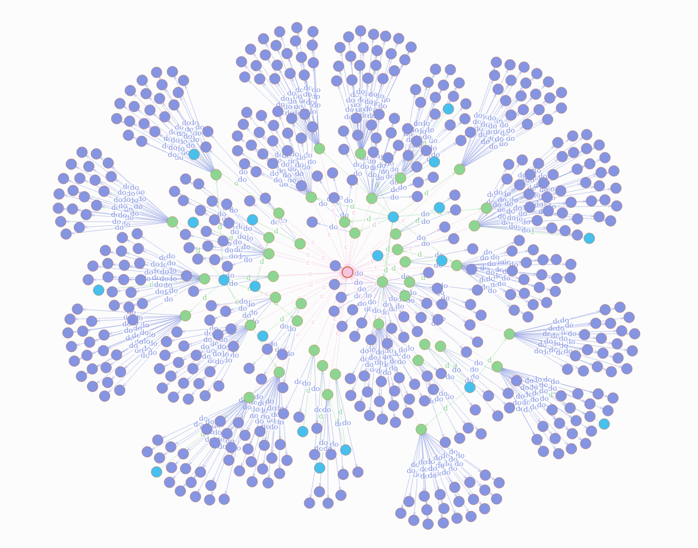

# Mining Massive Data Sets - Final project

> by John Cunniff


## Initial Overview

I've downloaded some of the crawl data from september of this year from [common crawl](https://index.commoncrawl.org/). With this data, I want to do some form of Clustering / Social Network Graph type of processing.

### Preprocessing

The data came in a weird custom format that just wouldn't be easy to work with. I wrote [stream.py](./stream.py) which does some relatively simplistic streaming of the weird format to csv in a thread pool. Along with that I added the resolved IP, the [ASN](https://en.wikipedia.org/wiki/Autonomous_system_%28Internet%29), and the country the IP belongs to.

This step took a really long time. I pushed my poweredge R710 to the limit for 130+ hours. Resolving the DNS entires was the main thing slowing the streaming down.

### The raw data

I estimate that I have ~1.96B rows of individual documents. This is a sample of the raw data after post processing

|INDEX |domain              |ip           |asn_num|country|asn_org                |path                                                        |
|------|--------------------|-------------|-------|-------|-----------------------|------------------------------------------------------------|
|0     |aice-interpretes.com|89.140.72.171|6739   |ES     |ONO-AS Cableuropa - ONO|/es/consejos-sonidos-eventos-traductores.php                |
|1     |aice-interpretes.com|89.140.72.171|6739   |ES     |ONO-AS Cableuropa - ONO|/es/contacto-interpretes-traductores-de-conferencia-aice.php|
|2     |aice-interpretes.com|89.140.72.171|6739   |ES     |ONO-AS Cableuropa - ONO|/es/contratar-interprete-de-conferencia-aice.php            |
|3     |aice-interpretes.com|89.140.72.171|6739   |ES     |ONO-AS Cableuropa - ONO|/es/enlace-1-traductor-interprete.php                       |
|4     |aice-interpretes.com|89.140.72.171|6739   |ES     |ONO-AS Cableuropa - ONO|/es/enlace-6-traductor-interprete.php                       |
|5     |aice-interpretes.com|89.140.72.171|6739   |ES     |ONO-AS Cableuropa - ONO|/es/equipo-tecnico-eventos-traductores.php                  |
|6     |aice-interpretes.com|89.140.72.171|6739   |ES     |ONO-AS Cableuropa - ONO|/es/estudiar-grado-traductor-interprete.php                 |
|7     |aice-interpretes.com|89.140.72.171|6739   |ES     |ONO-AS Cableuropa - ONO|/es/estudiar-interpretacion.php                             |
|8     |aice-interpretes.com|89.140.72.171|6739   |ES     |ONO-AS Cableuropa - ONO|/es/estudiar-postgrado-traductor-interprete.php             |
|9     |aice-interpretes.com|89.140.72.171|6739   |ES     |ONO-AS Cableuropa - ONO|/es/experiencia-especializacion.php                         |


### Graphs

I've begun to create graphs from the raw data using [dgraph](https://dgraph.io/). I would not recommend that anyone uses dgraph. It uses its own version of graphql. This decision makes dgraph another promising tool to fall for the overhyped garbage that is graphql. All the graphql schema, and query crap stretched out what should have taken 20 minutes into 2 days.

anyway....

I've created a graph where the different unique entities within the csv are represented. Nodes are ASNs, countries, domains, and documents. Using a fraction of a percent of the data I have processed.



The red node in the center is the US. The blue nodes are the ASNs within the US (of the data that was rendered). The green nodes are the domains within the ASNs. The purple nodes off the domains are the documents seen (limited to 20 per domain).


The graph schema is as follows

```graphql
# ASN fields
asnnum: int @index(int) .
org: string .
domains: [uid] @reverse .

# Domain fields
domain: string @index(term,exact) .
tld: string .
ip: string .
documents: [uid] @reverse .
country: [uid] @reverse .

# Document fields
path: string @index(term) .

# Country fields
country_code: string @index(exact) .

type ASN {
    asnnum
    org
    domains
}

type Domain {
    domain
    tld
    ip
    documents
    country
}

type Document {
    path
}

type Country {
    country_code
    domains
}
```

### Queries

```graphql
query {  
  getcountry(func: type(Country)) {
    country_code

    domains(first: 100) {
      domain
      ~domains {
        asnnum
      }
      documents(first: 10) {
        path
      }
    }
  }
}
```


```graphql
query {  
  getcountry(func: eq(country_code, "US")) {
    country_code

    domains(first: 100) {
      domain
      ~domains {
        asnnum
      }
      documents(first: 10) {
        path
      }
    }
  }
}
```


### Ingestion


